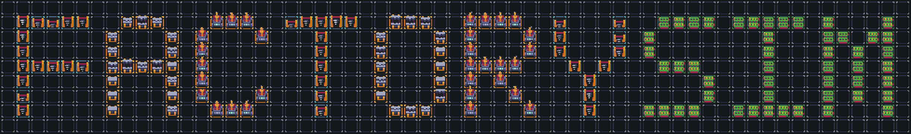

# FactorySim-GUI



A factory simulation game built with [libGDX](https://libgdx.com/) that allows users to design, build, and optimize production systems.

## Description

FactorySim is a factory design and simulation tool that allows users to create complex production systems by placing buildings (mines, factories, storage facilities, drone ports, and waste disposal units), connecting them with paths, and optimizing the flow of resources. The simulation runs in discrete time steps or real-time mode, enabling users to observe and improve their factory's efficiency.

## Features

- **Building Types**:
  - **Mines**: Extract resources using predefined recipes
  - **Factories**: Process inputs into outputs based on recipes
  - **Storage**: Store specific items with customizable capacity and priority
  - **Drone Ports**: Enable aerial delivery of resources
  - **Waste Disposal**: Process waste products at configurable rates

- **Connection System**:
  - Build paths between buildings to enable resource flow
  - Manage delivery networks with visual feedback

- **Simulation Modes**:
  - Discrete step-by-step simulation for precise control
  - Real-time simulation with adjustable speed
  - Pause, resume, and stop simulation controls

- **Interface**:
  - Intuitive building placement and connection
  - Zoom and pan controls for easy navigation
  - Detailed information panels for buildings
  - Real-time logging system
  - Save/load functionality

- **Additional Features**:
  - Formula system for defining item types and recipes
  - User request system for simulating demand
  - Policy configuration for production priorities

## Getting Started

### Prerequisites

- Java 8 or higher
- Graphics card supporting OpenGL 2.0+

### Installation

#### From Source

1. Clone the repository:
   ```
   git clone https://github.com/yourusername/factorysim-gui.git
   ```

2. Navigate to the project directory:
   ```
   cd factorysim-gui
   ```

3. Build the project with Gradle:
   ```
   ./gradlew build
   ```

4. Run the application:
   ```
   ./gradlew lwjgl3:run
   ```

#### From Release

1. Download the latest release JAR file
2. Run the application:
   ```
   java -jar factorysim-gui.jar
   ```

## Controls

- **Camera Movement**: WASD or Arrow Keys
- **Zoom**: Mouse Wheel
- **Place Building**: Select building type and left-click on grid
- **Connect Buildings**: In connect mode, click on source building then destination building
- **Select Building**: Left-click on building
- **Fast Camera Movement**: Hold Shift while moving camera
- **Cancel Action**: Right-click

## User Guide

1. Start a new simulation or load an existing one
2. Place mines to gather resources
3. Add factories to process resources
4. Connect buildings with paths to enable resource flow
5. Add storage buildings to manage inventory
6. Run the simulation in steps or real-time mode
7. Monitor efficiency and optimize your design

## Project Structure

- `core`: Main module with shared application logic
- `lwjgl3`: Desktop platform implementation using LWJGL3
- `assets`: Contains textures, sounds, and other resources

## Development

This project uses Gradle for dependency management. See the "Gradle" section below for useful commands.

## Gradle

This project uses [Gradle](https://gradle.org/) to manage dependencies.
The Gradle wrapper is included, so you can run Gradle tasks using `gradlew.bat` or `./gradlew` commands.

Useful Gradle tasks and flags:

- `--continue`: when using this flag, errors will not stop the tasks from running.
- `--daemon`: thanks to this flag, Gradle daemon will be used to run chosen tasks.
- `--offline`: when using this flag, cached dependency archives will be used.
- `--refresh-dependencies`: this flag forces validation of all dependencies. Useful for snapshot versions.
- `build`: builds sources and archives of every project.
- `cleanEclipse`: removes Eclipse project data.
- `cleanIdea`: removes IntelliJ project data.
- `clean`: removes `build` folders, which store compiled classes and built archives.
- `eclipse`: generates Eclipse project data.
- `idea`: generates IntelliJ project data.
- `lwjgl3:jar`: builds application's runnable jar, which can be found at `lwjgl3/build/libs`.
- `lwjgl3:run`: starts the application.
- `test`: runs unit tests (if any).

Note that most tasks that are not specific to a single project can be run with `name:` prefix, where the `name` should be replaced with the ID of a specific project.
For example, `core:clean` removes `build` folder only from the `core` project.

## License

This project is licensed under the MIT License - see the LICENSE file for details.

## Acknowledgments

- Built with [libGDX](https://libgdx.com/)
- Generated with [gdx-liftoff](https://github.com/libgdx/gdx-liftoff)
- Uses [VisUI](https://github.com/kotcrab/vis-ui) for UI components
